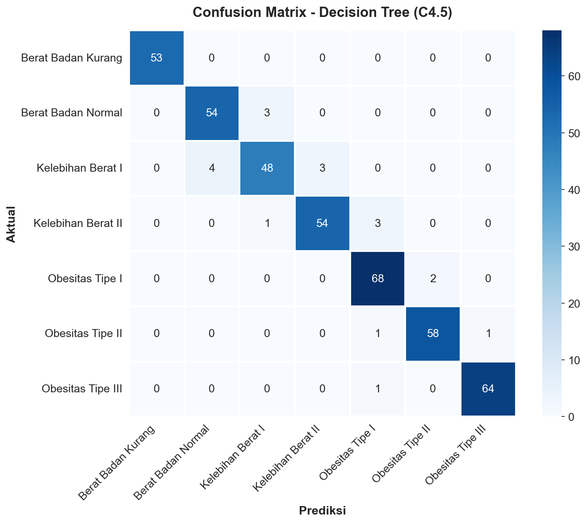
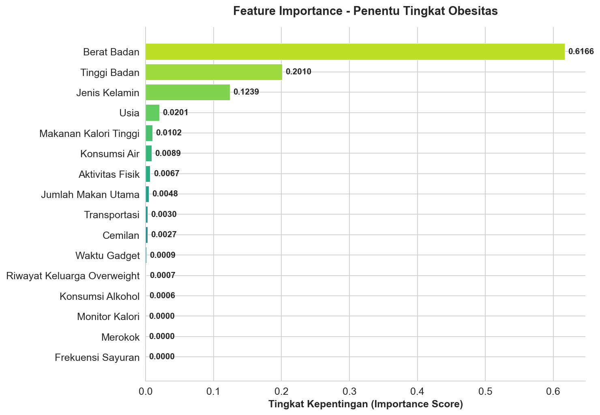
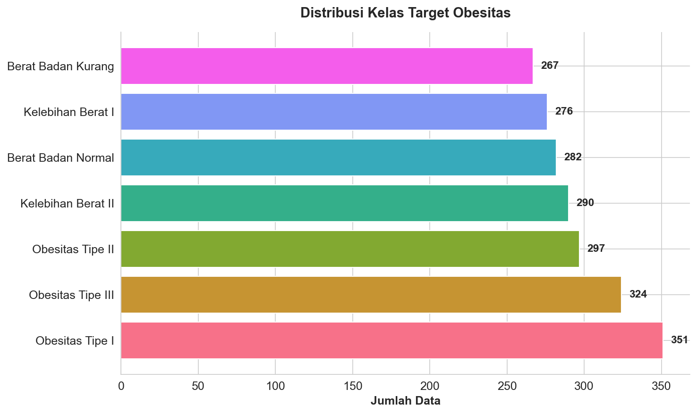

# 🎓 Klasifikasi Tingkat Obesitas dengan Algoritma C4.5 (Decision Tree)

> **Machine Learning Classification Portfolio Project**  
> Created by Muhammad Prayoga Putra Mahardhika


---

## 📌 Deskripsi & Hasil Proyek (What is Produced)

Proyek portofolio ini menghasilkan **sebuah model klasifikasi berbasis Machine Learning (Decision Tree C4.5)** yang mampu mendiagnosis dan memprediksi tingkat obesitas seseorang ke dalam **7 kelas berbeda** dengan tingkat akurasi mencapai **97.37%**.

Melalui proyek ini, dihasilkan pula **insight data-driven** terkait faktor-faktor penentu obesitas, di mana atribut fisik seperti **Berat Badan** memegang pengaruh paling krusial (>58%), jauh lebih signifikan daripada kebiasaan konsumsi atau gaya hidup sekunder. Hal ini membuktikan kemampuan model ini tidak hanya sebagai alat prediksi (*black-box*), melainkan sebagai alat bantu diagnostik yang *interpretable* (*white-box*) untuk ranah kesehatan.

### Ringkasan Evaluasi Model

| Metrik | Skor |
|:------:|:----:|
| **Accuracy** | **97.37%** |
| **Precision** | **97.42%** |
| **Recall** | **97.37%** |
| **F1-Score** | **97.36%** |

---

## 🖼️ Visualisasi Hasil Analisis

Berikut adalah beberapa hasil visualisasi output yang di-generate langsung dari model klasifikasi di Jupyter Notebook:

### 1. Confusion Matrix (Evaluasi Prediksi)
Menunjukkan performa model yang luar biasa dengan sangat minimnya kesalahan prediksi antar kelas (sebagian besar data berada tepat di garis diagonal utama). Label tingkat obesitas telah disesuaikan ke Bahasa Indonesia.
<p align="center">
  
</p>

### 2. Feature Importance (Faktor Penentu Obesitas)
Menunjukkan metrik *Information Gain* terbesar didominasi oleh fitur berat badan. Label fitur di visualisasi ini telah disesuaikan ke Bahasa Indonesia agar lebih mudah dipahami secara visual.
<p align="center">
  
</p>

### 3. Distribusi Kelas Obesitas
Memperlihatkan persebaran 7 kelas target obesitas dalam dataset yang cukup seimbang (*balanced*).
<p align="center">
  
</p>

---

## 📊 Dataset

**Obesity Levels Dataset** ([UCI Machine Learning Repository](https://archive.ics.uci.edu/dataset/544/estimation+of+obesity+levels+based+on+eating+habits+and+physical+condition))

Dataset berisi estimasi tingkat obesitas berdasarkan kebiasaan makan dan kondisi fisik dari penduduk Meksiko, Peru, dan Kolombia.

- **Jumlah data**: 2.111 baris (2.087 setelah proses data cleaning)
- **Jumlah fitur**: 16 fitur + 1 variabel target
- **Variabel target**: `NObeyesdad` (7 kelas tingkat obesitas)

### Fitur Dataset

Dataset ini menggunakan nama kolom asli berbahasa Inggris di level *source code*, namun visualisasi datanya disajikan dalam Bahasa Indonesia untuk kemudahan interpretasi.

| No | Fitur | Tipe | Keterangan |
|:--:|-------|:----:|------------|
| 1 | `Gender` | Kategorikal | Jenis kelamin (Male/Female) |
| 2 | `Age` | Numerik | Usia (dalam tahun) |
| 3 | `Height` | Numerik | Tinggi badan (dalam meter) |
| 4 | `Weight` | Numerik | Berat badan (dalam kg) |
| 5 | `family_history_with_overweight` | Kategorikal | Riwayat keluarga overweight (yes/no) |
| 6 | `FAVC` | Kategorikal | Konsumsi makanan berkalori tinggi (yes/no) |
| 7 | `FCVC` | Numerik | Frekuensi konsumsi sayuran (1-3) |
| 8 | `NCP` | Numerik | Jumlah makan utama per hari (1-4) |
| 9 | `CAEC` | Kategorikal | Konsumsi makanan di antara waktu makan |
| 10 | `SMOKE` | Kategorikal | Kebiasaan merokok (yes/no) |
| 11 | `CH2O` | Numerik | Konsumsi air per hari (1-3 liter) |
| 12 | `SCC` | Kategorikal | Monitoring konsumsi kalori (yes/no) |
| 13 | `FAF` | Numerik | Frekuensi aktivitas fisik (0-3) |
| 14 | `TUE` | Numerik | Waktu penggunaan gadget (0-2 jam) |
| 15 | `CALC` | Kategorikal | Frekuensi konsumsi alkohol |
| 16 | `MTRANS` | Kategorikal | Moda transportasi utama |

---

## 🧠 Algoritma C4.5 (Decision Tree)

Algoritma **C4.5** dikembangkan oleh **Ross Quinlan** sebagai penyempurnaan dari algoritma ID3. C4.5 membangun pohon keputusan menggunakan:

1. **Entropy** — mengukur tingkat ketidakpastian data:
   $$Entropy(S) = -\sum_{i=1}^{n} p_i \cdot \log_2(p_i)$$

2. **Information Gain** — mengukur pengurangan entropy setelah split:
   $$Gain(S, A) = Entropy(S) - \sum_{v \in Values(A)} \frac{|S_v|}{|S|} \cdot Entropy(S_v)$$

3. Atribut dengan **Information Gain tertinggi** dipilih sebagai node keputusan.
4. Proses diulang secara **rekursif** hingga seluruh data terklasifikasi.

Implementasi proyek ini menggunakan `DecisionTreeClassifier(criterion='entropy')` dari *scikit-learn* untuk mencerminkan mekanisme seleksi atribut dari algoritma C4.5.

---

## 🔄 Metodologi

```
┌──────────┐    ┌──────────────┐    ┌──────────────┐    ┌──────────┐    ┌──────────┐    ┌────────────┐
│  Dataset │───▶│    Data      │───▶│    Data      │───▶│ Algoritma│───▶│ Evaluasi │───▶│ Visualisasi│
│ (2111    │    │Understanding │    │Preprocessing │    │   C4.5   │    │  Model   │    │   Hasil    │
│  data)   │    │              │    │              │    │          │    │          │    │            │
└──────────┘    └──────────────┘    └──────────────┘    └──────────┘    └──────────┘    └────────────┘
```

### Tahapan:

1. **Data Understanding** — Eksplorasi dataset, analisis statistik deskriptif, visualisasi distribusi kelas target.
2. **Data Preprocessing** — Data cleaning (menghapus duplikat), feature encoding (Label Encoding & Ordinal Encoding), dan splitting dataset (80% Train, 20% Test dengan parameter `stratify=y`).
3. **Model Implementation** — Membangun model Decision Tree menggunakan parameter optimal untuk reproducibility.
4. **Model Evaluation** — Mengukur performa menggunakan metrik Confusion Matrix, Accuracy, Precision, Recall, dan F1-Score.
5. **Data Visualization** — Mengekspor visualisasi dari model menjadi gambar representatif yang disimpan di folder `outputs/`.

---

## 📁 Struktur Repository

```
obesity-level-classification-c45/
├── 📓 Obesity_Level_Classification_C45.ipynb            # Notebook utama berisi seluruh source code ML
├── 📊 ObesityDataSet_raw_and_data_sinthetic.csv         # Dataset utama
├── 📂 outputs/                                          # Folder penyimpan grafis output (images)
│   ├── confusion_matrix.png
│   ├── feature_importance.png
│   └── target_distribution.png
├── 📄 README.md                                         # Dokumentasi proyek (file ini)
├── 📄 LICENSE                                           # Lisensi MIT
└── 📄 .gitignore                                        # Git ignore rules
```

---

## 🚀 Cara Menjalankan Project

### Prasyarat

- Python 3.10+
- Jupyter Notebook / JupyterLab

### Menjalankan Secara Lokal

```bash
# Clone repository
git clone https://github.com/MuhammadPrayoga/obesity-level-classification-c45.git
cd obesity-level-classification-c45

# Install dependencies yang dibutuhkan
pip install pandas numpy scikit-learn matplotlib seaborn

# Buka dan jalankan notebook
jupyter notebook "Obesity_Level_Classification_C45.ipynb"
```

---

## 👤 Author

**Muhammad Prayoga Putra Mahardhika**
- GitHub: [@MuhammadPrayoga](https://github.com/MuhammadPrayoga)

---

## 📄 Lisensi

Proyek ini dilisensikan di bawah [MIT License](LICENSE).
